# 4-stage RISC-V Core
  This repository contains information and codes of the 4-stage Pipelined RISC-V Core (and calculator) designed during the [RISC-V MYTH Workshop](https://github.com/stevehoover/RISC-V_MYTH_Workshop). The core supports the RV32I Base Integer Instruction Set and it is developed in [TL-Verilog](http://tl-x.org/) using [Makerchip](https://makerchip.com/).

# Design of 1024x32 SRAM (4KB) using OpenRAM and SKY130 PDKs 
  This aims at design of 1024x32 SRAM cell array (4KB) with a configuration of 1.8 V operating voltage and access time less than 2.5ns using Google SkyWater SKY130 PDKs and OpenRAM memory complier.

# Table of Contents
  - [Introduction To RISC-V ISA](#Introduction-to-risc-v-isa)
  - [Compiler Toolchain](#compiler-toolchain)
  - [Application Binary Interface](#application-binary-interface)
  - [RTL Design Using TL-Verilog and MakerChip](#rtl-design-using-tl-verilog-and-makerchip)
      - [Designing a Simple Calculator](#designing-a-simple-calculator)
      - [Pipelining the Calculator](#pipelining-the-calculator)
      - [Adding Validity to Calculator](#adding-validity-to-calculator)
  - [Basic RISC-V Core](#basic-risc-v-core)
      - [Program Counter and Instruction Fetch](#program-counter-and-instruction-fetch)
      - [Instruction Decode and Read Register File](#instruction-decode-and-read-register-file)
      - [Execute Instruction and Write Register File](#execute-instruction-and-write-register-file)
  - [Pipelined RISC-V Core](#pipelined-risc-v-core)
  - [Final 4-Stage RISC-V Core](#final-4-stage-risc-v-core)
      - [Final RISC-V Core](#final-risc-v-core)
      - [Code Comparison](#code-comparison)

  - [Introduction To SRAM Cell Design](#introduction-to-sram-cell-design)
  - [Setting Up Environment](#setting-up-environment)
      - [Open-Source Tools Used](#open-source-tools-used)
      - [Cloning and Installing](#cloning-and-installing)
      - [Independent Installation](#independent-installation)
  - [SRAM Memory Architecture](#sram-memory-architecture)
  - [Custom Cells for OpenRAM](#custom-cells-for-openram)
      - [About OpenRAM](#about-openram)
      - [Custom Cells](#custom-cells)
  - [OpenRAM Configuration For SkyWater SKY130 PDKs](#openram-configuration-for-skywater-sky130-pdks)
    - [Installation and Setup of OpenRAM](#installation-and-setup-of-openram)
    - [OpenRAM Directory Structure](#openram-directory-structure)
    - [Porting SKY130 to OpenRAM](#porting-sky130-to-openram)
      - [gds_lib directory](#gds_lib-directory)
      - [sp_lib directory](#sp_lib-directory)
      - [layers.map](#layersmap)
      - [tech Directory](#tech-directory)
    - [Sample OpenRAM Configurations](#sample-openram-configurations)
    - [Usage of OpenRAM](#usage-of-openram)
  - [Schematic and Simulations](#schematic-and-simulations)
      1. [6T SRAM Cell](#1-6t-sram-cell)
      2. [Pre-charge Circuit](#2-pre-charge-circuit)
      3. [Sense Amplifier](#3-sense-amplifier)
      4. [Write Driver](#4-write-driver)
      5. [Tri-State Buffer](#5-tri-state-buffer)
      6. [D-Flip-Flop](#6-d-flip-flop)
      - [1-bit SRAM](#1-bit-sram)
  - [OpenRAM Compiler Output Layout](#openram-compiler-output-layout)
  - [Contact Information](#contact-information)

  - [Future Work](#future-work)
  - [References](#references)
  - [Acknowledgement](#acknowledgement)

# Introduction To RISC-V ISA
RISC-V is a new ISA that's available under open, free and non-restrictive licences. RISC-V ISA delivers a new level of free, extensible software and hardware freedom on architecture.

  ## Why RISC-V?
  - Far simple and smaller than commercial ISAs.
  - Avoids micro-architecture or technology dependent features.
  - Small standard base ISA.
  - Multiple Standard Extensions.
  - Variable-length instruction encoding

  For more information about [RISC-V ISA](https://github.com/riscv/riscv-isa-manual)
 
# Compiler Toolchain
Toolchain simply is a set of tools used to compile a piece of code to produce a executable program. Similar to other ISAs RISC-V also has its own toolchain. 
Mentioned below are steps to use RISC-V toolchain

  ### Using RISC-V Complier:
    riscv64-unknown-elf-gcc -<compiler options> -mabi=<ABI options> -march=<Architecture options> -o <object filename> <C Program filename>
  - \<compiler options\>    : O1, Ofast
  - \<ABI options\>         : lp64, lp32
  - \<Architecture options\>: RV64, RV32
  
  ### Viewing the assembly language code:
    riscv64-unknown-elf-objdump -d <object filename>
  
  ### Simulating the object file using SPIKE simulator:
    spike pk <object filename>
    
  ### Debugging the object file using SPIKE:
    spike -d pk <object Filename>

# Application Binary Interface
Every application program runs in a particular environment, which "Application Execution Environment". How the application interfaces with the underlying execution environment is called the "Application Binary Interface (ABI)". 

The Application Binary Interface is the sum total of what the application programmer needs to understand in order to write programs; the programmer does not have to understand or know what is going on within the Application Execution Environment.

An Application Binary Interface would combine the processor ISA along with the OS system-call interface. The below snippet gives the list of registers, thier short description and ABI name of every register in RISC-V ISA.
 
   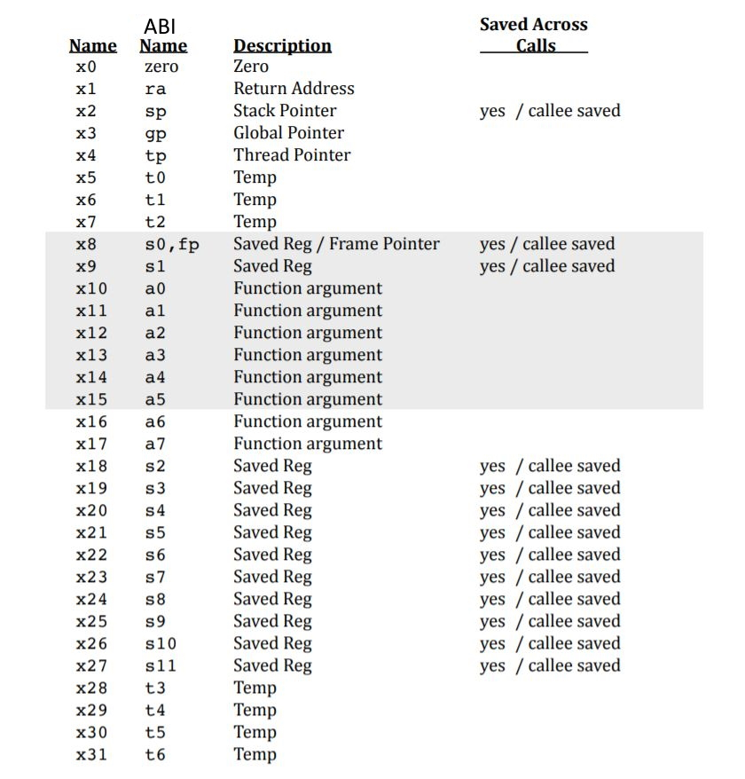

# RTL Design Using TL-Verilog and Makerchip
[Makerchip](http://makerchip.com/) is a free online environment for developing high-quality integrated circuits. You can code, compile, simulate, and debug Verilog designs, all from your browser. Your code, block diagrams, and waveforms are tightly integrated.

Following are some unique features of TL-Verilog:
  - Supports "Timing Abstraction"
  - Easy Pipelining
  - TL-Verilog removes the need always blocks, flip-flops.
  - Compiler available converts TL-Verilog to Verilog, which can be easily synthesized.

    

  ## Designing a Simple Calculator
  A simple implementation of a single stage basic calculator is done in TL-Verilog. The calculator will have two 32-bit input data and one 3-bit opcode. Depending upon the opcode value, calculator operation is selected.
  
  The below snippet shows the implementation in Makerchip. Here all the working of the calculator is done in a single stage.
  
  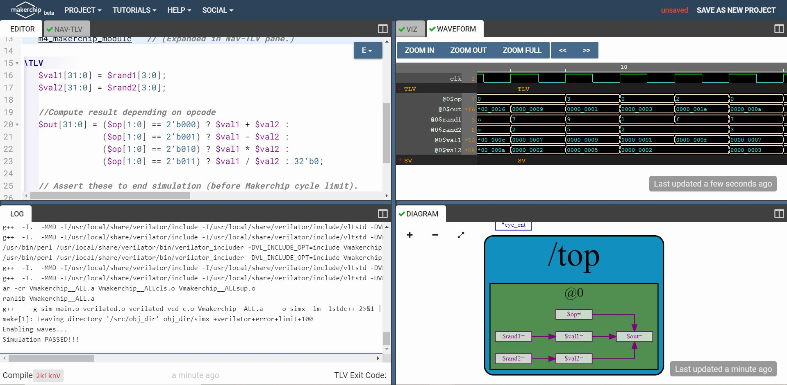
    
  ## Pipelining the Calculator
  The simple calculator developed above is pipelined using TL-Verilog. It seems very easy in TL-Verilog. No need of `always_ff @ (clk)` or any flip-flops, the pipelining can be done just by using `|calc` for defining pipeline and `@1` or `@2` for writing stages of pipeline. 
  
  The below snippet shows that in the pipeline Stage-1 is used for accepting inputs and Stage-2 for arithmetic operations.
    
  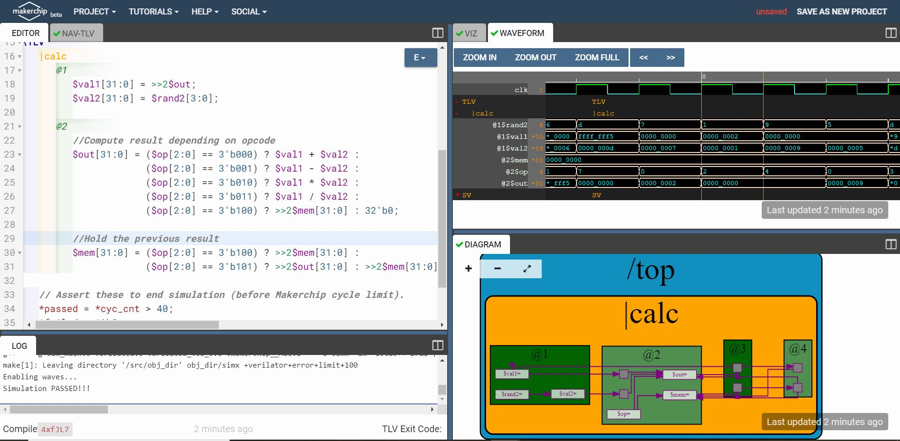
    
  ## Adding Validity to Calculator
  TL-Verilog supports a very unique feature called `validity`. Using validity, we can define tha condition when a specific signal will hold a valid content. The validity condition is written using `?$valid_variable_name`.
  
  The below snippet shows the implementation of validity. The calculator operation will only be carried out when there is no reset and it is a valid cycle.
  
   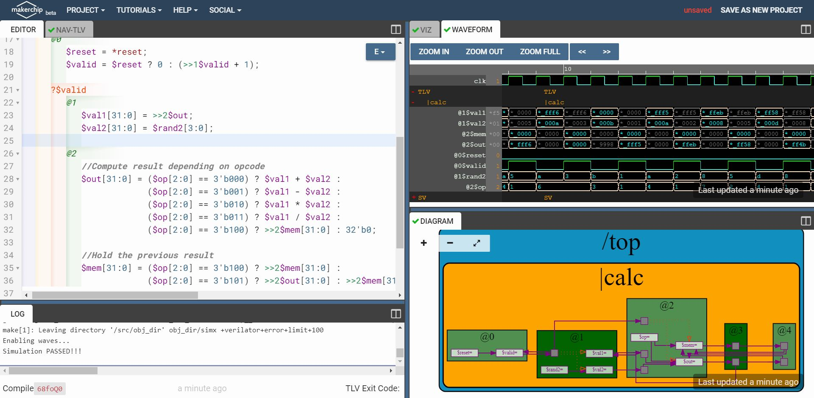
   
   The detailed TL-Verilog code for the calculator can be found [here](RISC-V_Core_4_Stage/calculator_solutions.tlv) 

# Basic RISC-V Core
  This section will cover the implementation of a simple 3-stage RISC-V Core / CPU. The 3-stages broadly are: Fetch, Decode and Execute.
  The diagram below is the basic block of the CPU core.
  
   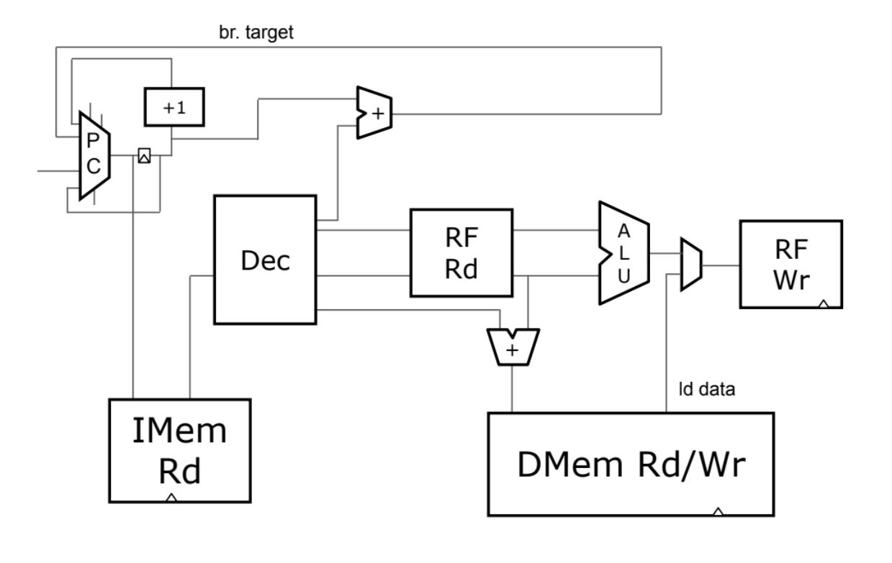
   
   ## Program Counter and Instruction Fetch
   Program Counter, also called as Instruction Pointer is a block which contains the address of the next instruction to be executed. It is feed to the instruction memory, which in turn gives out the instruction to be executed. The program counter is incremented by 4, every valid iteration.
   The output of the program counter is used for fetching an instruction from the instruction memory. The instruction memory gives out a 32-bit instruction depending upon the input address.
   The below snippet shows the Program Counter and Instruction Fetch Implementation in Makerchip.
   
   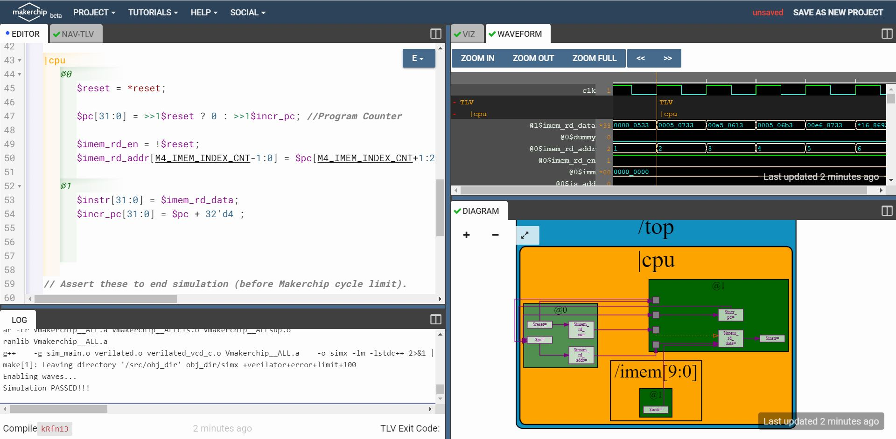
   
   ## Instruction Decode and Read Register File
   The 32-bit fetched instruction has to be decoded first to determine the operation to be performed and the source / destination address. Instruction Type is first identified on the opcode bits of instruction. The instruction type can R, I, S, B, U, J.
   Every instruction has a fixed format defined in the RISC-V ISA. Depending on the formats, the following fields are determined:
   - `opcode`, `funct3`, `funct7` -> Specifies the Operation
   - `imm` -> Immediate values / Offsets
   - `rs1`, `rs2` -> Source register index
   - `rd` -> Destination register index
   
   Generally, RISC-V ISA provides 32 Register each of width = `XLEN` (for example, XLEN = 32 for RV32) 
   Here, the register file used allows 2 - reads and 1 - write simultaneously.
   
   The below snippet shows the Decode and Read Register Implementation in Makerchip.
   
   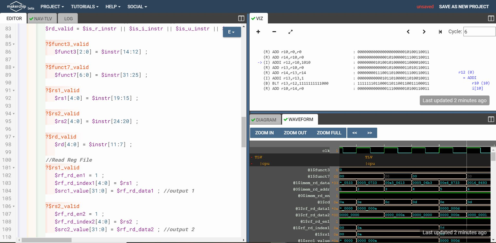
   
   ## Execute Instruction and Write Register File
   Depending upon the decoded operation, the instruction is executed. Arithmetic and Logical Unit (ALU) used if required. If the instruction is a branching instruction the target branch address is computed separately.
   After the instruction is executed, the result of stored back to the Register File, depending upon the destination register index.
   The below snippet shows the Instruction Execute and Write Register File Implementation in Makerchip.
   
   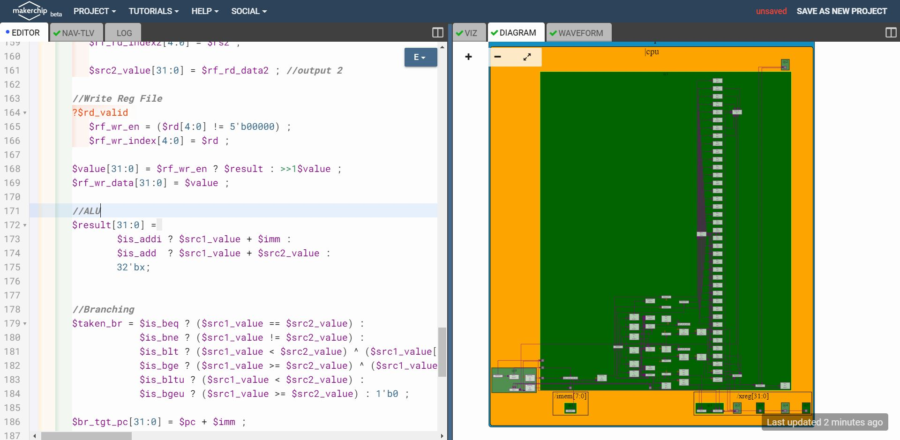

# Pipelined RISC-V Core
  Pipelining processes increases the overall performance of the system. Thus, the previously designed cores can be pipelined. The "Timing Abstraction" feature of TL-Verilog makes it easy.
  
  ## Pipelining the Core
  Pipelining in TL-Verilog can be done in following way:
  
    |<pipe_name>
    @<pipe_stage>
       Instructions present in this stage
    @<pipe_stage>
       Instructions present in this stage
  
  There are various hazards to be taken into consideration while implementing a pipelined design. Some of hazards taken under consideration are:
   - Improper Updating of Program Counter (PC)
   - Read-before-Write Hazard
   
  ## Load and Store Data
  A Data memory can be added to the Core. The Load-Store operations will add up a new stage to the core. Thus, making it now a 4-Stage Core / CPU.
  
  The proper functioning of the RISC-V core can be ensured by introducing some testcases to the code. 
  For example, if program for summation of positive integers from 1 to 9 and storing it to specific register can be verified by:
  
      *passed = |cpu/xreg[17]>>5$value == (1+2+3+4+5+6+7+8+9);
      
   Here, `xreg[17]` is the register holding the final result.
   
# Final 4-Stage RISC-V Core
  After pipelining is proved in simulations, the operations for Jump Instructions are added. Also, added Instruction Decode and ALU Implementation for RV32I Base Integer Instruction Set.
  
  The snippet below shows the successful implementation of 4-stage RISC-V Core
  
  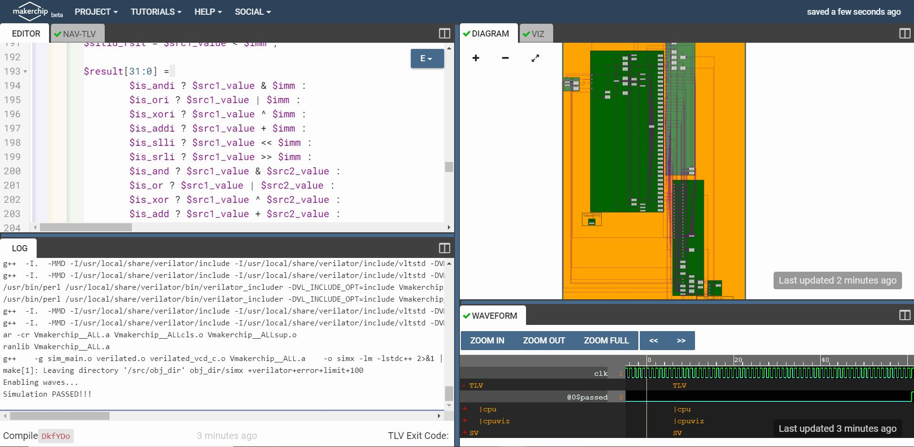
  
  The complete TL-Verilog code for 4-Stage RISC-V Core can be found [here](RISC-V_Core_4_Stage/risc-v_solutions.tlv) 
  
  ## Final RISC-V Core
  
  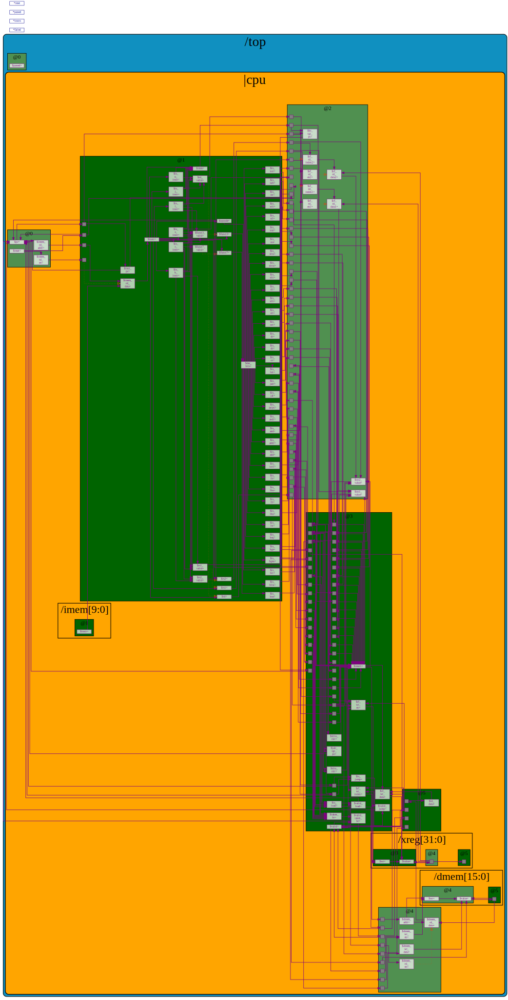
  
  ## Code Comparison
  The SandPiper Compiler generated ~90,000 characters of SystemVerilog from ~25,000 characters of TL-Verilog. Among the ~90,000 characters of SystemVerilog, only ~18,000 is actual logic.
  
  The snippet below shows the code comparison of TL-Verilog and SystemVerilog.
  
  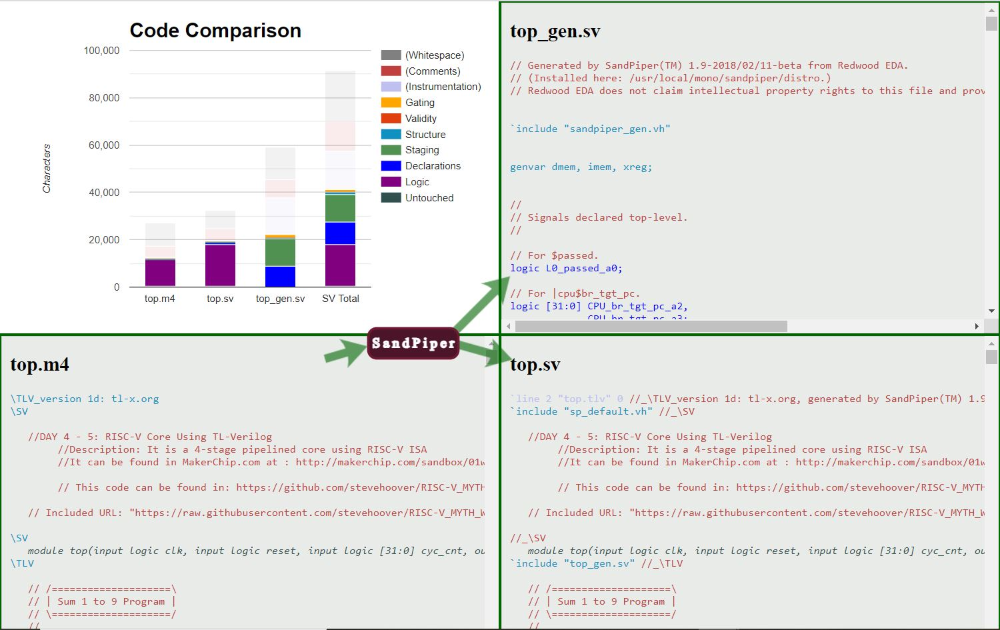
  
  
# Introduction To SRAM Cell Design
  Static Random-Access Memory (SRAM) is a standard element of modern architectures including Application Specific Integrated Circuit (ASIC), System-On-Chip (SoC), Field Programmable Gate Array (FPGA) and others. For these wide variety of applications, SRAMs are configured using parameters like alpha ratio, beta ratio, gamma ratio, operating voltage in the physical level and word-length, access time, and most importantly the technology node at the architectural level.
  
  Manually configuring the SRAM for every change in parameter seems a slightly in-efficient and tedious task. Due to this reason, the memory compiler is used on a large scale, as it facilitates easy configuration and optimization of memory. OpenRAM, an open-source memory compiler is used for characterization and generation of SRAM designs.
  
# Setting Up Environment
  This repository mentioned multiple open-source circuit schematic design, layout design, SPICE simulations tools and memory compiler. The tools used and their installation is explained in details below. The complete environemnt setup for the open-source OpenLANE RTL2GDS flow can be found [here](https://github.com/ShonTaware/openlane_environment_setup).

## Open-Source Tools Used
  | Name of Tool | Description |
  | --- | --- |
  | [NGSPICE](https://github.com/imr/ngspice) | An open-source mixed-level/mixed-signal electronic spice circuit simulator. |
  | [Xschem](https://github.com/StefanSchippers/xschem) | A schematic editor for VLSI/Asic/Analog custom designs, netlist backends for VHDL, Spice and Verilog. |
  | [Magic](https://github.com/RTimothyEdwards/magic) | An open-source VLSI Layout Tool with easy DRC options. |

## Cloning and Installing
  For properly installing all the above mentioned tools and supporting tools to their updated version follow the below mentioned steps.(Only for Ubuntu Operating System)

      $    sudo apt-get install git
      $    git clone https://github.com/Mufutee
vc/RISC-V_Core_External_SRAM_IMem.git
      $    cd SRAM_SKY130

  To install Ngspice, Magic and Xschem at once use commands below. It can be skipped otherwise.   

      $    chmod +777 setup_environment.sh
      $    ./setup_environment.sh

## Independent Installation
  1. **NGSPICE:** Following commands can be used for installing only the NGSPICE tool.

          $    sudo apt-get install ngspice

  2. **Xschem:** Following commands can be used for installing only the Xschem Schematic Editor tool.

          $    sudo apt-get install git
          $    git clone https://github.com/StefanSchippers/xschem.git
          $    cd xschem
          $    ./configure
          $    make
          $    sudo make install

  3. **Magic:** Following commands can be used for installing only the Magic Layout tool.

          $    sudo apt-get install git
          $    git clone https://github.com/RTimothyEdwards/magic.git
          $    cd magic
          $    ./configure
          $    make
          $    sudo make install      

# SRAM Memory Architecture
  SRAM Memory is a block which designed by integrating several sub-blocks. This SRAM memory architecture for a multi-port SRAM memory is shown in the diagram below.

  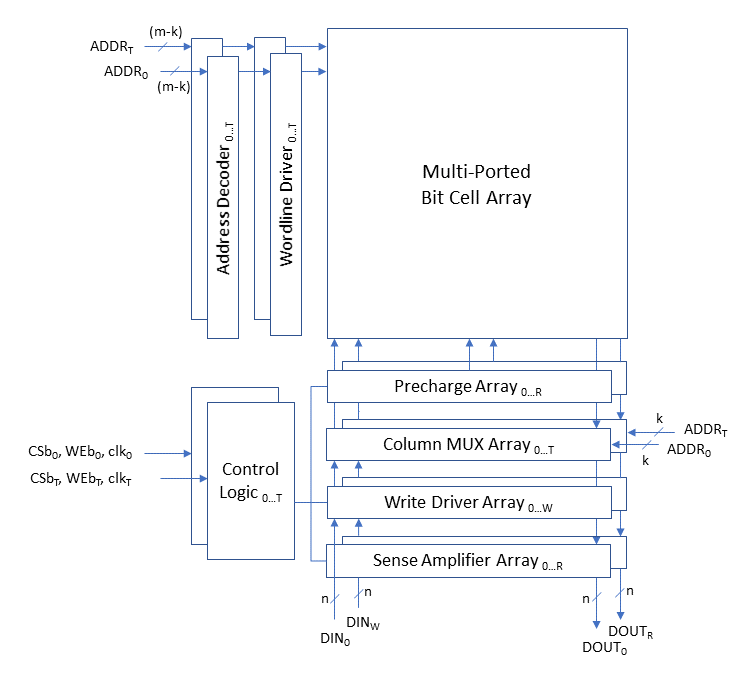

# Custom Cells for OpenRAM
  
## About OpenRAM
  OpenRAM is an open-source Python framework to create the layout, netlists, timing and power models, placement and routing models, and other views necessary to use SRAMs in ASIC design. It supports integration in both commercial and open-source flows with both predictive and fabricable technologies.

## Custom Cells
  OpenRAM facilitates to convert any custom design cells and design rules to various IP deliverables or formats.

  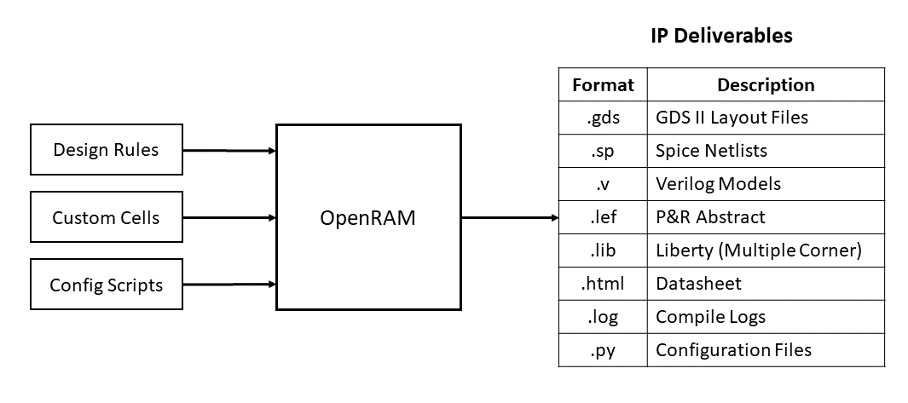

  OpenRAM uses some custom-designed library primitives as technology input. Since density is extremely important, the following cells are pre-designed in each technology: 
  * 6T cell
  * Sense amplifier
  * Master-slave flip-flop 
  * Tri-state gate 
  * Write driver

# OpenRAM Configuration For SkyWater SKY130 PDKs
The detailed OpenRAM configuration, usage and issues for SKY130 pdk is documented in this section.

## Installation and Setup of OpenRAM
The detailed OpenRAM project can be found [here](https://github.com/VLSIDA/OpenRAM). The steps to the installation and setup are mentioned below. The steps following will clone the OpenRAM compiler project and setup paths in `.bashrc` file.

  ```
    $    chmod 777 openram_setup.sh
    $    ./openram_setup.sh
    $    source ~/.bashrc
      
  ```

## OpenRAM Directory Structure
  After the installation is properly done. The directory structure of OpenRAM directory looks similar to that of mentioned. 
  ```
    ├── OpenRAM 
    |  ├── compiler
    |  ├── technologies
    |     ├── freepdk45  (available with compiler)
    |     ├── scn4m_subm (available with compiler)
    |     ├── sky130A 

  ```
  The `sky130A` directory is not available by default. You need to create it in order to add support for SkyWater PDK Sky130. The detailed contents and their description is explained further in the document. Also, the configure `sky130A` directory is included in the repository for reference. It can be found at [OpenRAM/sky130A/](https://github.com/ShonTaware/SRAM_SKY130/tree/main/OpenRAM/sky130A)

## Porting SKY130 to OpenRAM
The OpenRAM compiler is currently available for two technologies, namely - SCMOS and FreePDK45.
For adding a new technology support to OpenRAM, a directory with name of process node should be created in `technology` directory of OpenRAM.

The `technology` directory should contains following information.

  ```
    ├── technology 
    |  ├── sky130A
    |     ├── gds_lib
    |     ├── sp_lib
    |     ├── mag_lib (optional)
    |     ├── models
    |     ├── layers.map (can be included in another sub-directory)
    |     ├── tech
    |        ├── __init__.py
    |        ├── tech.py
    |        ├── sky130A.tech

  ```

### `gds_lib` directory
  This directory contains all the custom premade library cells in `.gds` file format. Following files should be listed in the gds_lib directory:
  1. dff.gds
  2. sense_amp.gds
  3. write_driver.gds
  4. cell_6t.gds
  5. replica_cell_6t.gds
  6. dummy_cell_6t.gds 

### `sp_lib` directory
This directory contains all the spice netlsits of custom premade library cells in `.sp` file format. 

### `models` directory
This directory contains all the NMOS and PMOS models for temperatures, voltages and process corners as per requirement. This repository contains the nfet and pfet models for all process corners operating at 1.8 V. 

### `layers.map`
This file contains the layer description for gds layers. It needs to be generated from the SKY130 PDK document provided by SkyWater. You can find the document [here](https://docs.google.com/spreadsheets/d/1oL6ldkQdLu-4FEQE0lX6BcgbqzYfNnd1XA8vERe0vpE/edit#gid=0).
  
The `layers.map` should be organized in a specific syntax. Here, each layer is given on a separate line in below mentioned format:

  ```
    <layer-name> <purpose-of-layer> <GDS-layer> <GDS-purpose>
  ```
The `layers.map` file is added to the repository and can be found [here](https://github.com/ShonTaware/SRAM_SKY130/blob/main/OpenRAM/sky130A/layers.map).  

### `tech/` Directory
  This directory should contains two mandatory file listed below. Any other optional scripts can also be included if required.

  * `tech/sky130A.tech`
  * `tech/tech.py`

### `tech/sky130A.tech`
  This is the technology file provided by SkyWater in the SKY130 PDKs. It needs to copied to this `tech` directory.
  The `sky130A.tech` technology file is added to the repository.

### `tech/tech.py`
  This python file contains all the technology related configuration. It contains information about below mentioned paramaters.
  
**Note:** The values for any parameters given below are only for reference and not the actual values. It will be replaced in future commits with correct and appropriate values for Sky130 process node. 

1. **Custom modules**
  ```
    tech_modules = module_type()
  ```

2. **Custom cell properties**
  ```
    cell_properties = cell_properties()
  ```

3. **Layer properties**
  ```
    layer_properties = layer_properties()
  ```

4. **GDS file info**
  ```
    GDS={}
    GDS["unit"]=(0.001,1e-6)
    GDS["zoom"] = 0.5
  ```

5. **Interconnect stacks**
  
  This defines the contacts and preferred directions of the metal, poly and active diffusion layers.
  ```
    poly_stack = ("poly", "poly_contact", "m1")
    active_stack = ("active", "active_contact", "m1")
    m1_stack = ("m1", "via1", "m2")
    m2_stack = ("m2", "via2", "m3")
    m3_stack = ("m3", "via3", "m4")
    
    layer_indices = {"poly": 0,
                     "active": 0,
                     "m1": 1,
                     "m2": 2,
                     "m3": 3,
                     "m4": 4}
    
    # The FEOL stacks get us up to m1
    feol_stacks = [poly_stack,
                   active_stack]
    
    # The BEOL stacks are m1 and up
    beol_stacks = [m1_stack,
                   m2_stack,
                   m3_stack]
    
    layer_stacks = feol_stacks + beol_stacks
    
    preferred_directions = {"poly": "V",
                            "active": "V",
                            "m1": "H",
                            "m2": "V",
                            "m3": "H",
                            "m4": "V"}
  ```

6. **Power grid**
  
  By default, the power grid is set to m3_stack i.e. it uses m3 and m4 layers for power grid.
  ```
    power_grid = m1_stack  # Use m1 and m2 for power grid
  ```

7. **GDS Layer Map**
  
  The values are similar to those listed in the `layers.map` file.
  ```
    layer["diff"]        = (65, 20)
    layer["tap"]         = (65, 44)
    layer["nwell"]       = (64, 20)
    layer["dnwell"]      = (64, 18)
    layer["npc"]         = (95, 20)
    layer["licon"]       = (66, 44)
    layer["li"]          = (67, 20)
    layer["mcon"]        = (67, 44)
    layer["m1"]          = (68, 20)
    layer["via"]         = (68, 44)
    layer["m2"]          = (69, 20)
    layer["via2"]        = (69, 44)
    layer["m3"]          = (70, 20)
    layer["via3"]        = (70, 44)
    layer["m4"]          = (71, 20)
    layer["via4"]        = (71, 44)
    layer["m5"]          = (72, 20)
    ...
  ```

8. **Layer names for external PDKs**
  ```
    layer_names = {}
    layer["diff"]        = "active"
    layer["tap"]         = "tap"
    layer["nwell"]       = "nwell"
    layer["dnwell"]      = "dnwell"
    layer["npc"]         = "npc"
    layer["licon"]       = "licon"
    layer["li"]          = "li"
    layer["mcon"]        = "mcon"
    layer["m1"]          = "m1"
    layer["via"]         = "via"
    layer["m2"]          = "m2"
    layer["via2"]        = "via2"
    layer["m3"]          = "m3"
    layer["via3"]        = "via3"
    layer["m4"]          = "m4"
    layer["via4"]        = "via4"
    layer["m5"]          = "m5"
    ...
  ```

9. **DRC/LVS Rules Setup**
  
  **Note:** Drc rules are required for all the layers mentioned in the interconnect stacks.
  ```
    drclvs_home=os.environ.get("DRCLVS_HOME")
    
    drc = design_rules("sky130A")
    
    #grid size is 1/2 a lambda
    drc["grid"]=0.5*_lambda_
    
    #DRC/LVS test set_up
    drc["drc_rules"] = drclvs_home+"/calibreDRC_sky130A.rul"  # Replace it with "None" to skip it
    drc["lvs_rules"] = drclvs_home+"/calibreLVS_sky130A.rul"  # Replace it with "None" to skip it
    drc["layer_map"] = os.environ.get("OPENRAM_TECH")+"/scn3me_subm/layers.map"
    
    # minwidth_tx with contact (no dog bone transistors)
    drc["minwidth_tx"] = 4*_lambda_
    drc["minlength_channel"] = 2*_lambda_
    
    # Minimum spacing between wells of different type (if both are drawn)
    drc["pwell_to_nwell"] = 0
    
    # Minimum width
    drc.add_layer("nwell",
                  width = 12*_lambda_,
                  spacing = 6*_lambda_)
    
    # Enclosure
    drc.add_enclosure("m1",
                    layer = "via1",
                    enclosure = _lambda_)
    ...
  ```

10. **Technology parameter**
  ```
    _lambda_ = 0.2

    #technology parameter
    parameter                = {}
    parameter["min_tx_size"] = 4*_lambda_
    parameter["beta"]        = 2
    
    # These 6T sizes are used in the parameterized bitcell.
    parameter["6T_inv_nmos_size"] = 8*_lambda_
    parameter["6T_inv_pmos_size"] = 3*_lambda_
    parameter["6T_access_size"]   = 4*_lambda_

  ```

11. **Spice Simulation Parameters**
  
    1. **Spice model info**
    ```
      # spice model info
      spice         = {}
      spice["sky130_fd_pr__nfet_01v8"] = "nmos"
      spice["sky130_fd_pr__pfet_01v8"] = "pmos"
      
    ```
    2. **Map of corners to model files**
    ```
      # This is a map of corners to model files
      SPICE_MODEL_DIR=os.environ.get("SPICE_MODEL_DIR")
      spice["fet_models"] = {"TT": [SPICE_MODEL_DIR + "/nom/pmos.sp", SPICE_MODEL_DIR + "/nom/nmos.sp"],
                             "FF": [SPICE_MODEL_DIR + "/ff/pmos.sp", SPICE_MODEL_DIR + "/ff/nmos.sp"],
                             "FS": [SPICE_MODEL_DIR + "/ff/pmos.sp", SPICE_MODEL_DIR + "/ss/nmos.sp"],
                             "SF": [SPICE_MODEL_DIR + "/ss/pmos.sp", SPICE_MODEL_DIR + "/ff/nmos.sp"],
                             "SS": [SPICE_MODEL_DIR + "/ss/pmos.sp", SPICE_MODEL_DIR + "/ss/nmos.sp"],
                             "ST": [SPICE_MODEL_DIR + "/ss/pmos.sp", SPICE_MODEL_DIR + "/nom/nmos.sp"],
                             "TS": [SPICE_MODEL_DIR + "/nom/pmos.sp", SPICE_MODEL_DIR + "/ss/nmos.sp"],
                             "FT": [SPICE_MODEL_DIR + "/ff/pmos.sp", SPICE_MODEL_DIR + "/nom/nmos.sp"],
                             "TF": [SPICE_MODEL_DIR + "/nom/pmos.sp", SPICE_MODEL_DIR + "/ff/nmos.sp"],
                             }

    ```

    3. **Spice stimulus related variables**
    ```
      spice["feasible_period"]    = 10              # estimated feasible period in ns
      spice["supply_voltages"]    = [4.5, 5.0, 5.5] # Supply voltage corners in [Volts]
      spice["nom_supply_voltage"] = 5.0             # Nominal supply voltage in [Volts]
      spice["rise_time"]          = 0.05            # rise time in [Nano-seconds]
      spice["fall_time"]          = 0.05            # fall time in [Nano-seconds]
      spice["temperatures"]       = [0, 25, 100]    # Temperature corners (celcius)
      spice["nom_temperature"]    = 25              # Nominal temperature (celcius)

    ```

    4. **Analytical delay parameters**
    ```
      spice["nom_threshold"]  = 1.3    # Nominal Threshold voltage in Volts
      spice["wire_unit_r"]    = 0.075  # Unit wire resistance in ohms/square
      spice["wire_unit_c"]    = 0.64   # Unit wire capacitance ff/um^2
      spice["min_tx_drain_c"] = 0.7    # Minimum transistor drain capacitance in ff
      spice["min_tx_gate_c"]  = 0.1    # Minimum transistor gate capacitance in ff
      spice["dff_setup"]      = 9      # DFF setup time in ps
      spice["dff_hold"]       = 1      # DFF hold time in ps
      spice["dff_in_cap"]     = 9.8242 # Input capacitance (D) [Femto-farad]
      spice["dff_out_cap"]    = 2      # Output capacitance (Q) [Femto-farad]

    ```

    5. **Analytical power parameters**
    ```
      spice["bitcell_leakage"] = 1 # Leakage power of a single bitcell in nW
      spice["inv_leakage"]     = 1 # Leakage power of inverter in nW
      spice["nand2_leakage"]   = 1 # Leakage power of 2-input nand in nW
      spice["nand3_leakage"]   = 1 # Leakage power of 3-input nand in nW
      spice["nand4_leakage"]   = 1 # Leakage power of 4-input nand in nW
      spice["nor2_leakage"]    = 1 # Leakage power of 2-input nor in nW
      spice["dff_leakage"]     = 1 # Leakage power of flop in nW
      
      spice["default_event_frequency"] = 100 # Default event activity of every gate. MHz
    ```

12. **Logical Effort relative values for the Handmade cells**
  ```
    parameter["le_tau"]              = 18.17         # In pico-seconds.
    parameter["min_inv_para_delay"]  = 2.07          # In relative delay units
    parameter["cap_relative_per_ff"] = .91           # Units of Relative Capacitance/ Femto-Farad
    parameter["dff_clk_cin"]         = 27.5          # In relative capacitance units
    parameter["6tcell_wl_cin"]       = 2             # In relative capacitance units
    parameter["sa_en_pmos_size"]     = 24 * _lambda_
    parameter["sa_en_nmos_size"]     = 9 * _lambda_
    parameter["sa_inv_pmos_size"]    = 18 * _lambda_
    parameter["sa_inv_nmos_size"]    = 9 * _lambda_
    parameter["bitcell_drain_cap"]   = 0.2           # In Femto-Farad, approximation of drain capacitance

  ```

13. **Technology Tool Preferences**
  ```
    drc_name = "magic"
    lvs_name = "netgen"
    pex_name = "magic"

  ```

## Sample OpenRAM Configurations
  The sample OpenRAM configurations are added to the repository. To use it, copy the `sky130A` directory into the `technology` directory of OpenRAM.

```
  cp -rf OpenRAM/sky130A $OPENRAM_TECH/
```
  * [Sample 2](https://github.com/ShonTaware/SRAM_SKY130/tree/main/OpenRAM/Sample2/sky130A): It modified technology files, mag_lib, sp_lib, gds_lib, tech.py and layers.map files.

## Usage of OpenRAM
  A configuration file need to be generated in python which contains all parameters required for the compiler. Every parameter mentioned in the configuration file overrides the default value of the parameter. If a parameter is not mentioned in the file, compiler will take a default value.
  
A template file named `myconfig_sky130.py` is added in the repository. The file contains these parameters.

```
  # Data word size
  word_size = 32
  
  # Number of words in the memory
  num_words = 1024

  # Technology to use in $OPENRAM_TECH
  tech_name = "sky130A"
  
  # You can use the technology nominal corner only
  #nominal_corner_only = True
  # Or you can specify particular corners
  # Process corners to characterize
  process_corners = ["TT"]
  
  # Voltage corners to characterize
  supply_voltages = [ 1.8 ]
  
  # Temperature corners to characterize
  # temperatures = [ 0, 25 100]

  # Output directory for the results
  output_path = "temp"
  
  # Output file base name
  output_name = "sram_{0}_{1}_{2}".format(word_size,num_words,tech_name)

  # Disable analytical models for full characterization (WARNING: slow!)
  # analytical_delay = False
```

  OpenRAM is invoked using the following command
```
  python3 $OPENRAM_HOME/openram.py myconfig_sky130.py
```

  
  
  
  
  

### Active Layer and Active Contact
Sky130 do not consist any layer named `active` or `active_contact` as that in case of other default technologies.
The default `active` layer corresponds to `diff` (active diffusion) layer in SKY130. Similarly, the default `active_contact` layer corresponds to  `tap` layer in SKY130.

```
  layer["diff"]        = (65, 20)
  layer["tap"]         = (65, 44)

  layer["diff"]        = "active" 
  layer["tap"]         = "tap"

```

### Missing Boundary layer definition
One of the major issue in OpenRAM configuration is, the SKY130 PDK do not have boundary layer definition for drawing purpose in the [GDS layer description provided by SkyWater](https://docs.google.com/spreadsheets/d/1oL6ldkQdLu-4FEQE0lX6BcgbqzYfNnd1XA8vERe0vpE/edit#gid=0). But OpenRAM compiler expects a boundary layer to compute the cell area and to avoid overlapping of cells.

# Schematic and Simulations

## 1. 6T SRAM Cell
  As the name says, 6T SRAM cell consists of 6 MOSFETS - 2 PMOS and 4 NMOS. It is design by cross coupling two CMOS inverters which hold the bit, and two access transistor for enabling the access to the cross coupled inverters.

  

### Schematic
  The figure below shows the schematic of the generic 6T SRAM cell. Here, M1, M2 make the first inverter; M3, M4 make the second inverter and M5, M6 are the access transistors.

  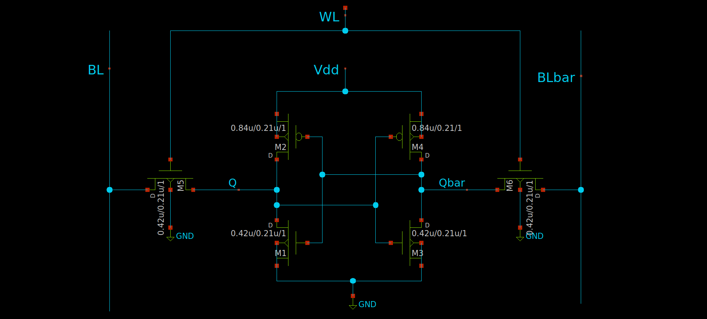

### Read Operation
  The read operation is a critical one in SRAM cell. Before enabling the access transistors, the bit-lines are first pre-charged to high logic. Depending upon the bit store, one of the bit-line is pulled back to logic low when the access transistors are enabled. 

	$    ngspice Prelayout/Spice_models/SRAM_6T_Cell_read.spice

  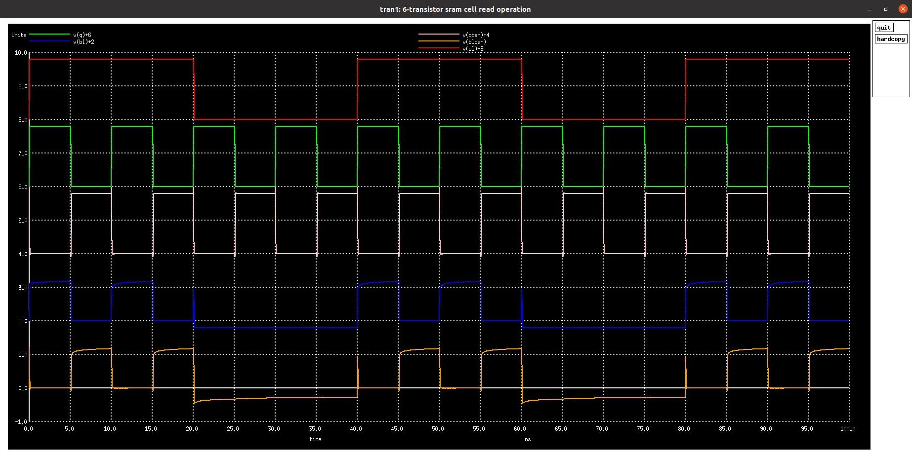

### Write Operation
  The bit to be written is first loaded to the bit-line and its inverted bit is loaded on the other bit-line. Once the access transistors are enabled the bit values on bit-lines are over-written on the inverter logic.

	$    ngspice Prelayout/Spice_models/SRAM_6T_Cell_write.spice

  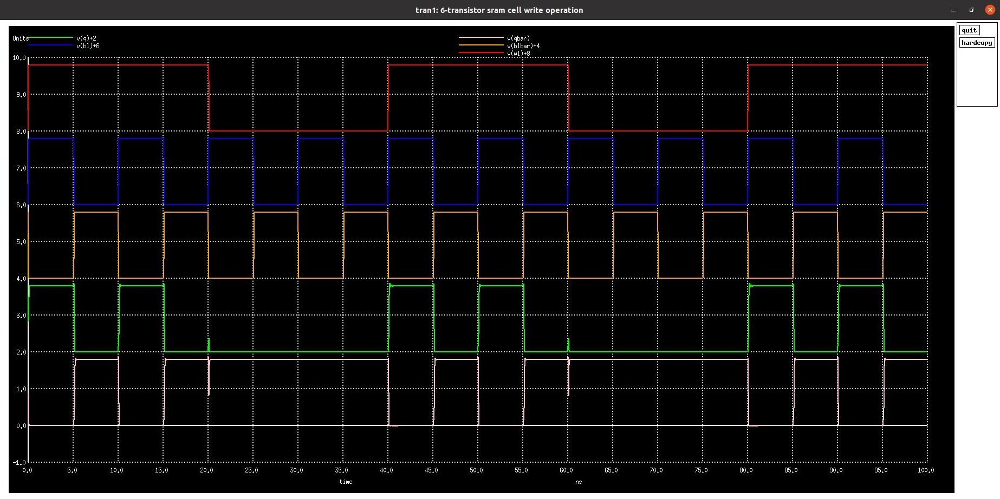

### Analyzing Stability of 6T SRAM Cell

* **Static Noise Margin**

  Static noise margin (SNM) is a key figure of merit for an SRAM cell. It can be extracted by nesting the largest possible square in the two voltage transfer curves (VTC) of the two CMOS inverters involved. The SNM is defined as the side-length of the square (i.e. diagonal-length), given in volts. When an external DC noise is larger than the SNM, the state of the SRAM cell can change and data is lost.

1. **Hold SNM**

  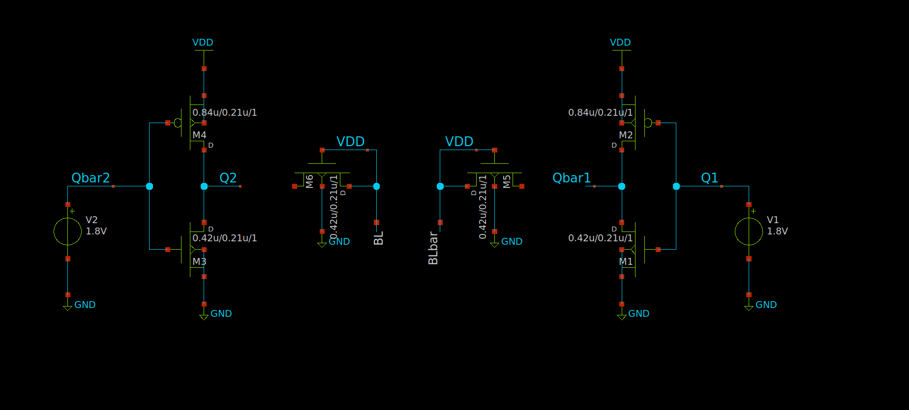

        $    ngspice Prelayout/Spice_models/SRAM_Cell_hold_snm.spice

  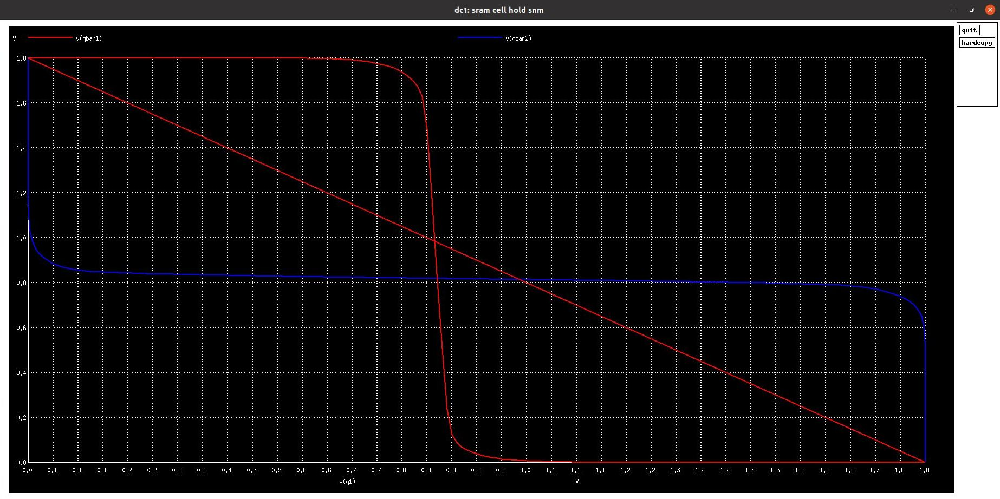
  SNM<sub>high</sub> = 1.0879 V <br />
  SNM<sub>low</sub> = 1.1112 V <br />
  Hold SNM = min(SNM<sub>high</sub>, SNM<sub>low</sub>) = 1.0879 V  <br /><br />

2. **Read SNM**

  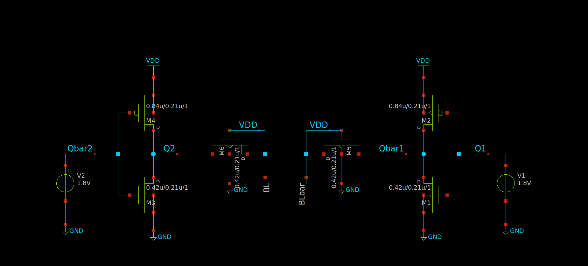

        $    ngspice Prelayout/Spice_models/SRAM_Cell_read_snm.spice

  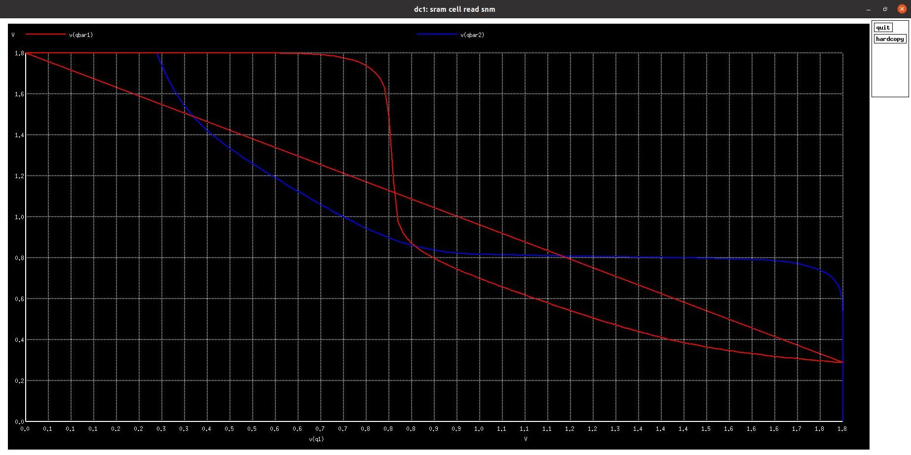
  SNM<sub>high</sub> = 0.5511 V <br />
  SNM<sub>low</sub> = 0.4294 V <br />
  Read SNM = min(SNM<sub>high</sub>, SNM<sub>low</sub>) =  0.4294 V <br /><br />

3. **Write SNM**

  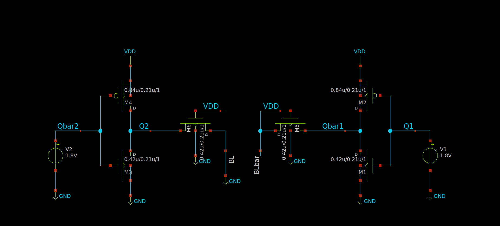

        $    ngspice Prelayout/Spice_models/SRAM_Cell_write_snm.spice

  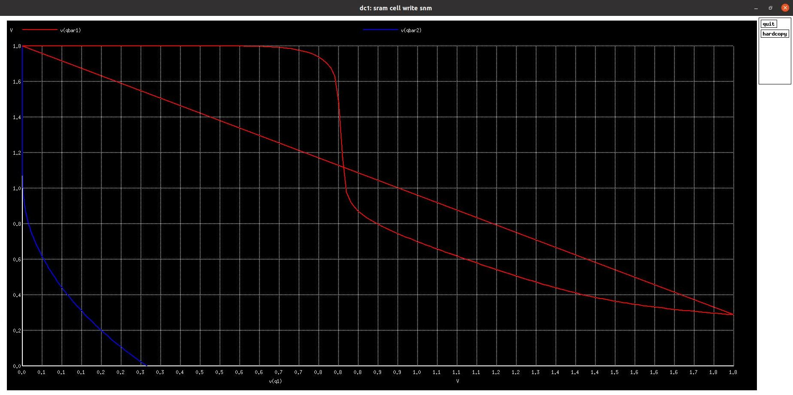
  Write SNM = 1.3494 V  <br /><br />

* **N-Curve**
  N-curve is a metric used for inline testers. It gives information for both voltage and current, and in addition it has no voltage scaling delimiter as found in SNM approach. It also has the complete information about the SRAM stability and also write ability in a single plot. N-curve can be further extended to power metrics in which both the voltage and current information are taken into consideration to provide better stability analysis of the SRAM cell.

  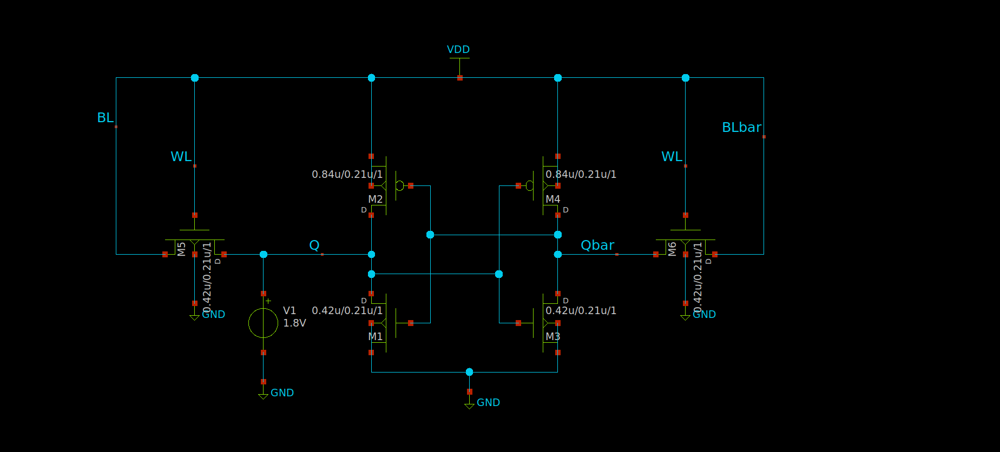

        $    ngspice Prelayout/Spice_models/SRAM_Cell_n_curve.spice

  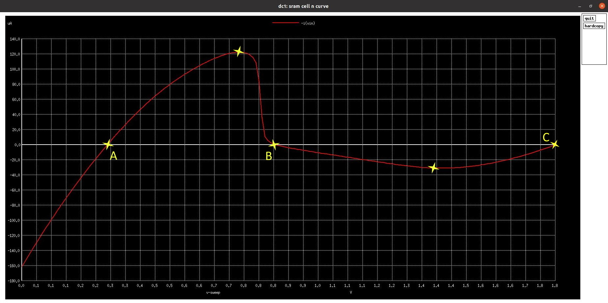

  1. **Static Voltage Noise Margin (SVNM):** It is the voltage difference between point A and B. It indicates the maximum tolerable DC noise voltage of the cell before its content changes.
  <br /> SVNM = 0.5644 V

  2. **Static Current Noise Margin (SINM):** It is the additional current information provided by the N-curve, namely the peak current located between point A and B. It can also be used to characterize the cell read stability.
  <br /> SINM = 122.6 uA

  **Note:** For better read stability, SVNM and SINM must be high value.

  3. **Write-Trip Voltage (WTV):** It is the voltage difference between point C and B. It is the voltage drop needed to flip the internal node “1” of the cell with both the bit-lines clamped to VDD.
  <br /> WTV = 0.9422 V
  
  4. **Write-Trip Current (WTI):** It is the negative current peak between point C and B. It is the amount of current needed to write the cell when both bit-lines are kept at VDD.
  <br /> WTI = -30.869 uA

## 2. Pre-charge Circuit
  This circuit block is used to pre-charge the bit-lines to VDD or high logic during a read operation. This is done to 

  Shown below is the schematic and simulation of the Pre-charge circuit.

  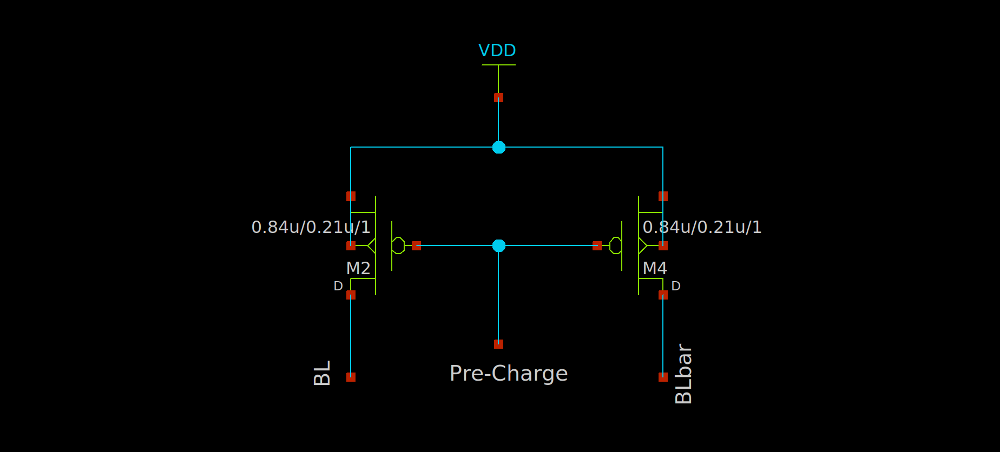

	$    ngspice Prelayout/Spice_models/precharge_circuit.spice

  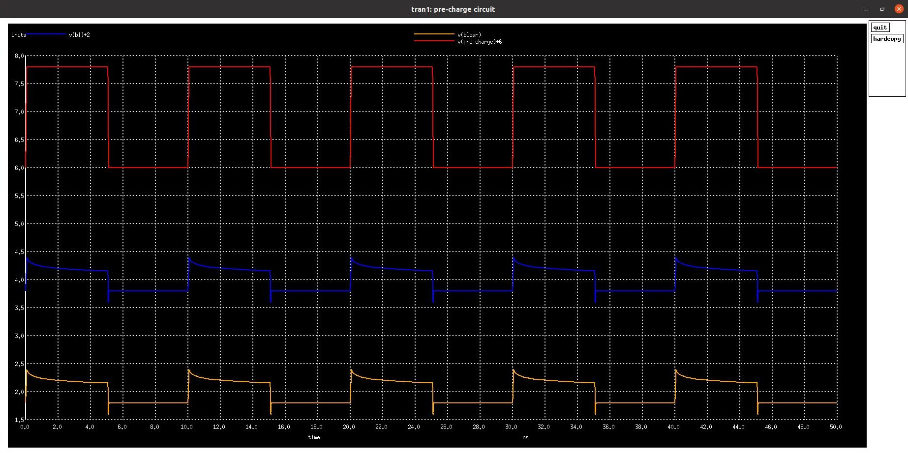

## 3. Sense Amplifier
  Sense Amplifiers in SRAM generally a Differential Voltage Amplifier. They form a very important part of SRAM memory as these amplifiers define the robustness of the bit-lines sensing. The function of sense amplifier is to amplify the very small analog differential voltage between the bit-lines during a read operation and provide a digital output. This effectively reduces the time required for the read operation, as each individual cell need not fully discharge the bit line.
  * if bit > bit_bar, output is 1
  * if bit < bit_bar, output is 0

  Shown below is the schematic and simulation of a Sense Amplifier.

  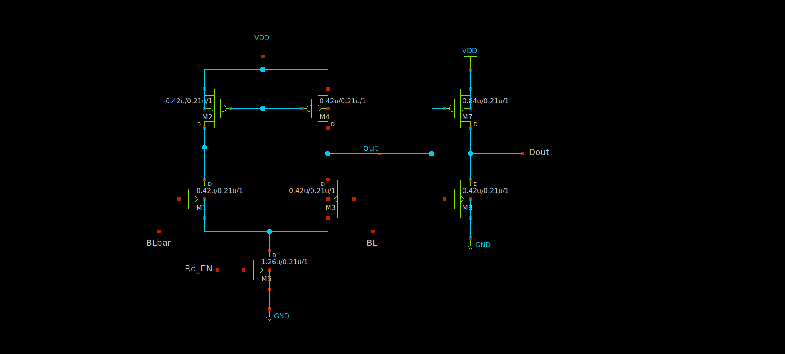

        $    ngspice Prelayout/Spice_models/sense_amplifier.spice

  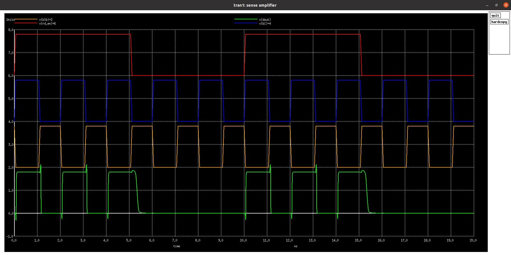

## 4. Write Driver
  As discussed in read operation, the bit-lines are pre-charged to Vdd during the read operation. If a write operation occurs, one of the bit-lines should driven back to low logic before enabling access transistors. Write drivers are used for this purpose.

  Shown below is the schematic and simulation of a Write Driver.

  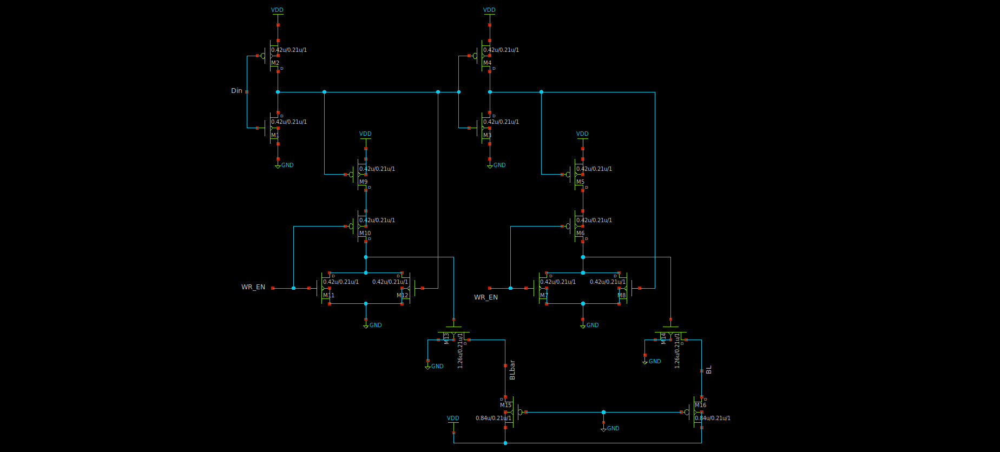

      	$    ngspice Prelayout/Spice_models/write_driver.spice

  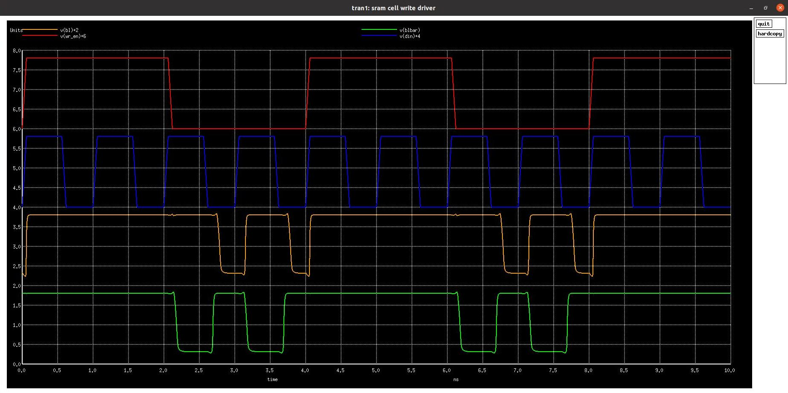

## 5. Tri-State Buffer
  Tri-state buffer is a normal buffer with an extra enable input. Whenever, the enable input is high, tri-state buffer behaves as a normal buffer, otherwise it will either give high impedance or low logic as output.

  Shown below is the schematic and simulation of a Tri-State Buffer.

  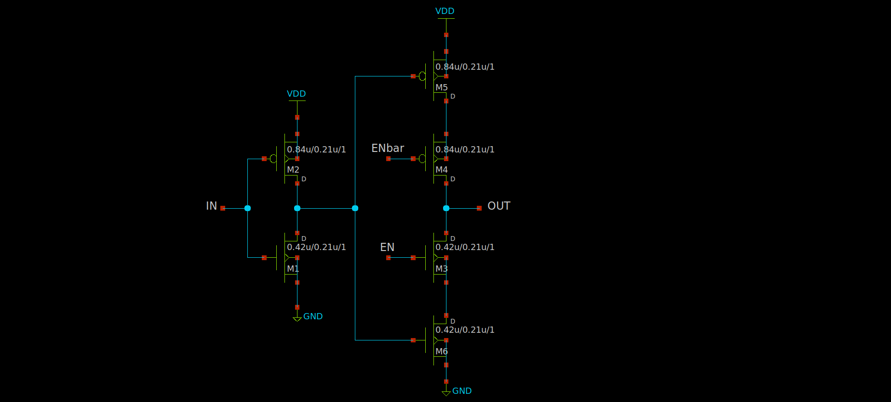

      	$    ngspice Prelayout/Spice_models/tristate_buffer.spice

  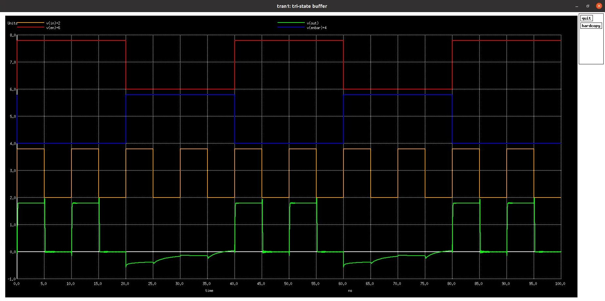

## 6. D-Flip-Flop
  Shown below is the schematic and simulation of a Positive Edge triggered D-Flip-Flop.

  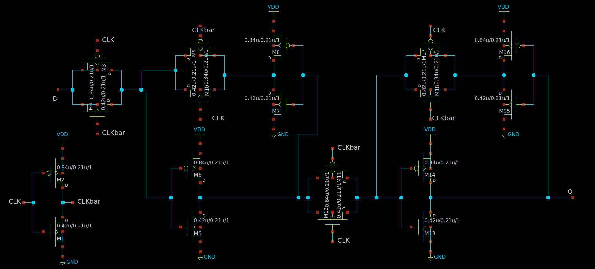

      	$    ngspice Prelayout/Spice_models/d_ff.spice

  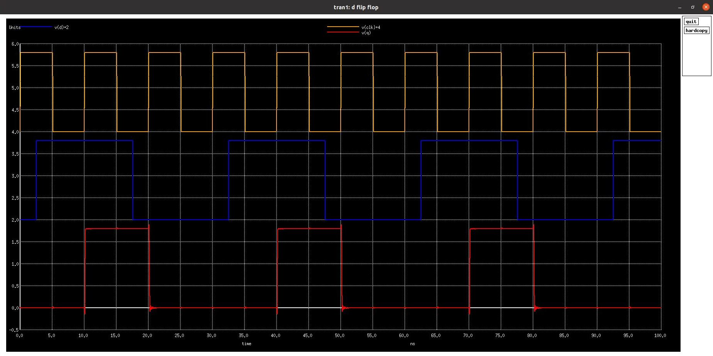

## 1-bit SRAM
  1-bit SRAM comprises of a 6T SRAM cell, a sense amplifier, a write driver and a pre-charge circuit.

  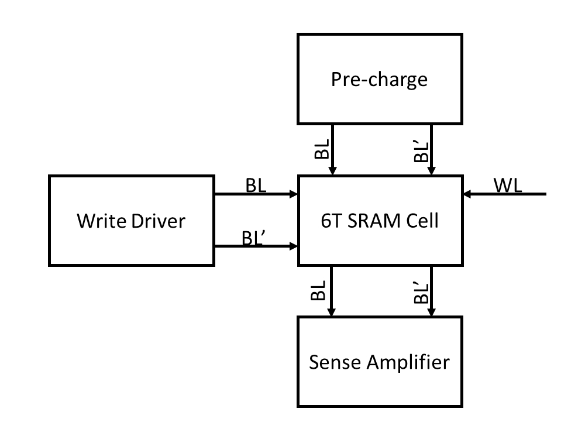

  * Read Operation

        $    ngspice Prelayout/Spice_models/SRAM_1bit_read.spice

  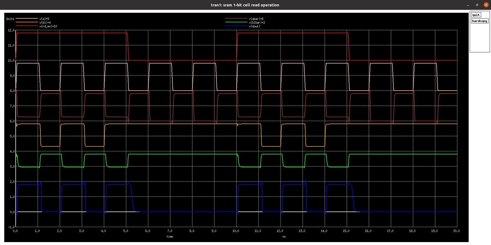

  * Write Operation

        $    ngspice Prelayout/Spice_models/SRAM_1bit_write.spice

  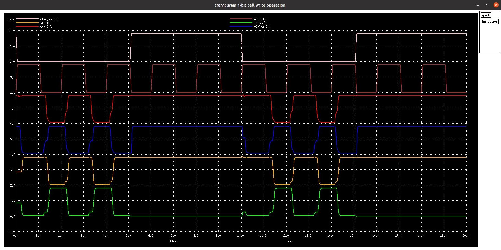

# Layout

## 6T SRAM Cell

  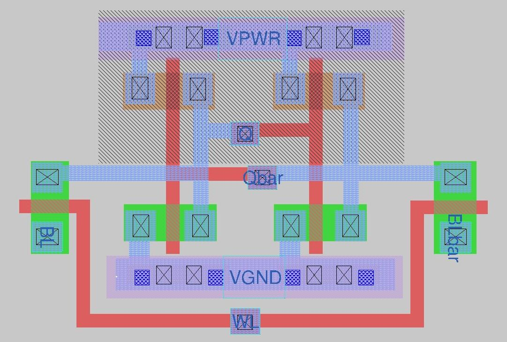
  
# OpenRAM Compiler Output Layout
  The Layout for 2 X 16 SRAM cell is show below. The detailed report can be found [here](https://htmlpreview.github.io/?https://github.com/ShonTaware/SRAM_SKY130/blob/main/OpenRAM/results/SRAM_2x16/sram_2_16_sky130A.html)
  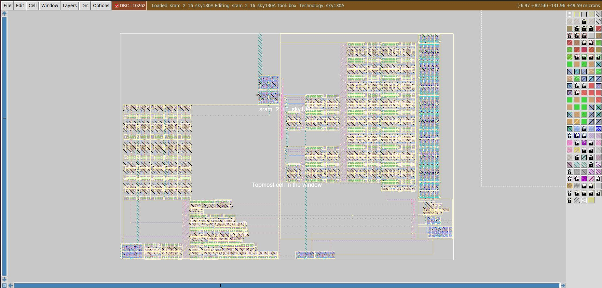

  The Layout for 32 X 1024 SRAM cell is show below. The detailed report can be found [here](https://htmlpreview.github.io/?https://github.com/ShonTaware/SRAM_SKY130/blob/main/OpenRAM/results/SRAM_32x1024/sram_32_1024_sky130A.html)
  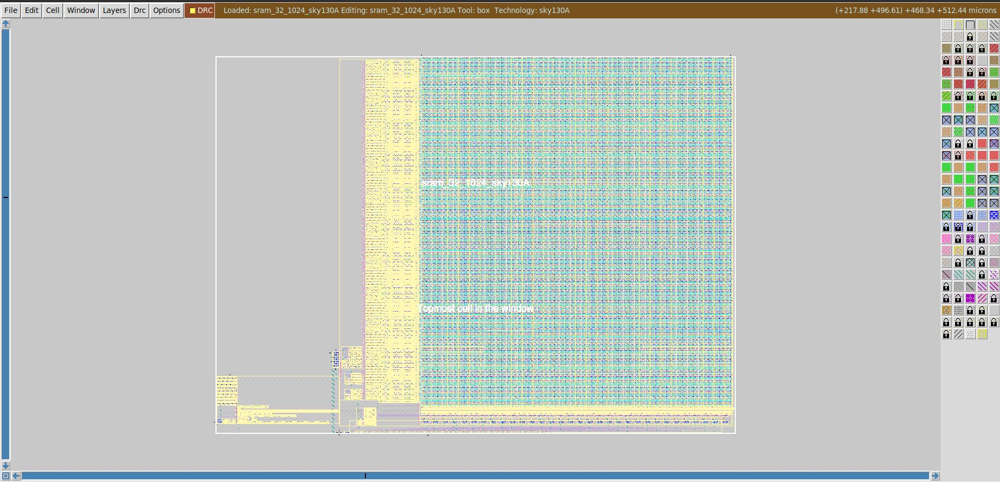

# Future Work
  Integrate the external SRAM memory to serve as an external instruction memory with a RISC-V core 

# References
  - RISC-V ISA Manual: https://github.com/riscv/riscv-isa-manual/
  - RISC-V: https://riscv.org/
  - Makerchip : https://makerchip.com/

  - VLSI System Design: https://www.vlsisystemdesign.com/
  - Efabless OpenLANE: https://github.com/efabless/openlane
  - OpenRAM: https://vlsida.github.io/OpenRAM/
  - M. Guthaus et al., “OpenRAM: An open-source memory compiler,” *2016 IEEE/ACM International Conference on Computer-Aided Design(ICCAD)*, Austin, TX, 2016, pp. 1-6.
  - Nickson Jose: [Standard cell design and characterization using openlane flow](https://github.com/nickson-jose/vsdstdcelldesign)

# Acknowledgement
  - [Kunal Ghosh](https://github.com/kunalg123), Co-founder, VSD Corp. Pvt. Ltd.
  - [Shon Taware](https://www.linkedin.com/in/Shon-Taware), M. Tech Embedded Systems and VLSI Design
  - [Steve Hoover](https://github.com/stevehoover), Founder, Redwood EDA
  
# Contact Information
  - [Mufutau Akuruyejo](https://www.linkedin.com/in/MuFuTeeVC/), MS Electrical and Computer Engineering, GaTech
  - [Kunal Ghosh](https://github.com/kunalg123), Co-founder, VSD Corp. Pvt. Ltd.
